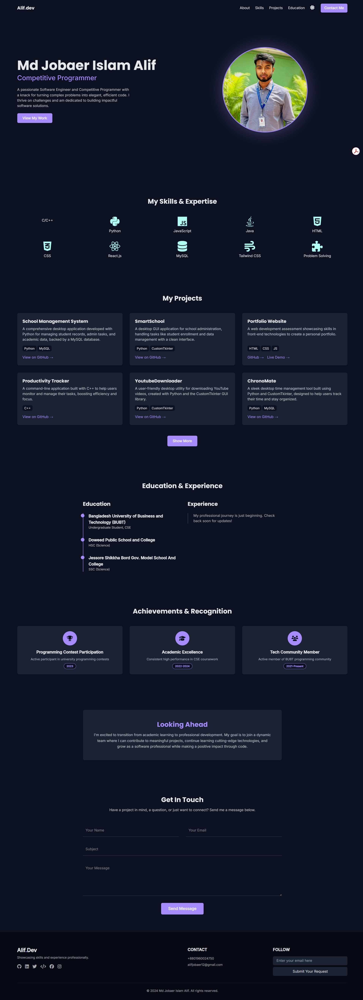

# 🌐 Alif.Dev – Personal Portfolio Website

A modern, responsive, and interactive personal portfolio website built with **HTML**, **Tailwind CSS**, and **JavaScript** to showcase my skills, projects, achievements, and contact information.  
This site is designed with a **dark/light mode toggle**, smooth animations, and a clean UI for an engaging user experience.

---

## ✨ Features

- 🎨 **Responsive Design** – Works seamlessly on all devices.
- 🌙 **Dark/Light Mode** – Theme toggle with smooth icon animation.
- 🖱 **Smooth Scrolling & AOS Animations** – Engaging scroll-based effects.
- 📂 **Project Showcase** – Expandable section to display more projects.
- 🏆 **Achievements & Recognition** – Highlights academic and extracurricular accomplishments.
- 📧 **Contact Form** – Integrated with Formspree for direct communication.
- 🖌 **Custom UI Enhancements** – Hover effects, floating labels, and animated icons.

---

## 📁 Project Structure

```
├── index.html        # Main HTML structure
├── css/
│   └── style.css     # Custom styles & animations
├── js/
│   └── script.js     # Theme toggle, mobile menu, and UI logic
├── public/
│   └── profile.jpg   # Profile image
```

---

## 🚀 Technologies Used

- **HTML5**
- **Tailwind CSS** (CDN)
- **JavaScript (Vanilla)**
- **AOS.js** for animations
- **Font Awesome** for icons
- **Google Fonts** – Poppins & Inter

---

## 📸 Screenshots


<p align="center">
  
</p>


---

## ⚡ How to Use

1. **Clone the repository**
   ```bash
   git clone https://github.com/your-username/portfolio-website.git
   ```

2. **Open in browser**
   ```bash
   cd portfolio-website
   open index.html
   ```
   *(Or simply double-click `index.html`)*

---

## 🔧 Customization

- **Profile Picture**: Replace `public/profile.jpg` with your own.
- **Projects**: Update the projects in the `#projects` section of `index.html`.
- **Contact Form**: Replace the Formspree `action` URL with your own form endpoint.
- **Colors & Fonts**: Adjust Tailwind theme configuration in the `<script>` inside `index.html`.

---

## 📬 Contact

- **Portfolio:** [Alif.dev](https://alifjobaer12.surge.sh/)
- **GitHub:** [@alifjobaer12](https://github.com/alifjobaer12)
- **LinkedIn:** [Md Jobaer Islam Alif](https://www.linkedin.com/in/alifjobaer12)
- **Email:** [alifjobaer12@gmail.com](mailto:alifjobaer12@gmail.com)

---

## 📝 License

This project is licensed under the MIT License. You are free to modify and use it as you wish.

---
💡 *"Showcasing skills and experience professionally."*
